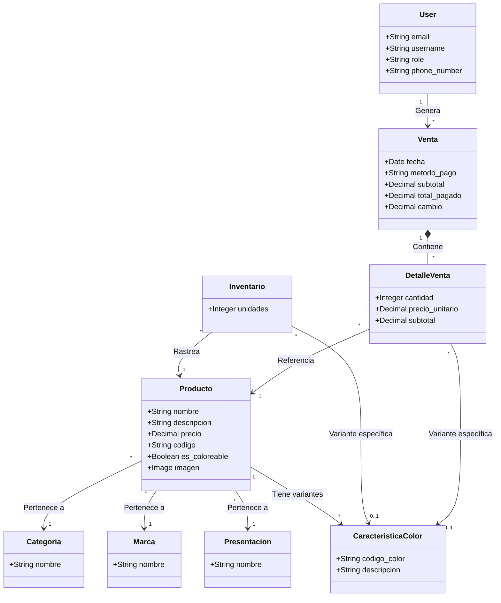

# 📦 Sistema de Punto de Venta e Inventario en Django

Bienvenido a **AgControl**, un robusto sistema backend construido con **Django** y **Django REST Framework (DRF)**, diseñado para gestionar un flujo completo de Punto de Venta (POS) e inventario. Este sistema maneja eficientemente catálogos de productos, niveles de existencias, transacciones de ventas y gestión de usuarios.

## 🚀 Características Clave

*   **Gestión Integral de Inventario:** 
    *   Seguimiento de **Productos**, **Categorías**, **Marcas** y **Presentaciones**.
    *   Gestión de variantes de productos con **Características de Color**.
    *   Monitoreo de existencias en tiempo real.
*   **Procesamiento de Ventas:**
    *   Registro de transacciones de ventas con detalles por ítem.
    *   Soporte para múltiples métodos de pago (Efectivo, Digital).
    *   Deducción automática de stock al realizar una venta.
*   **Gestión de Usuarios:**
    *   Control de acceso basado en roles (Administrador, Usuario).
    *   Autenticación segura utilizando **JWT (JSON Web Tokens)**.
*   **Diseño API-First:**
    *   Construido con **Django REST Framework** para una integración fluida con aplicaciones frontend (Web, Móvil).
    *   **CORS** habilitado para solicitudes de origen cruzado.
*   **Arquitectura Escalable:**
    *   Estructura modular de aplicaciones (`core`, `users`, `products`, `inventory`, `sales`).
    *   Listo para **PostgreSQL** en producción (configurado con `psycopg2-binary`).

## 🛠️ Arquitectura del Sistema

El backend está estructurado en aplicaciones Django modulares, cada una manejando una lógica de dominio específica. El siguiente diagrama ilustra las relaciones entre los modelos principales y el flujo de datos.



## ⚙️ Instalación y Configuración

Sigue estos pasos para configurar el proyecto localmente.

### Requisitos Previos
*   Python 3.10+
*   pip (gestor de paquetes de Python)
*   Entorno virtual (recomendado)

### 1. Clonar el Repositorio
```bash
git clone <url_del_repositorio>
cd <directorio_del_proyecto>
```

### 2. Crear y Activar Entorno Virtual

**Windows:**
```bash
python -m venv venv
.\venv\Scripts\Activate
```

**Linux/macOS:**
```bash
python3 -m venv venv
source venv/bin/activate
```

### 3. Instalar Dependencias
Puedes instalar todos los paquetes requeridos usando el archivo de requisitos:
```bash
pip install -r requirements.txt
```

O instalar los paquetes individualmente:
```bash
pip install django djangorestframework djangorestframework-simplejwt psycopg2-binary django-cors-headers pillow
```

### 4. Migraciones de Base de Datos
Aplica las migraciones para configurar el esquema de tu base de datos (por defecto es SQLite para desarrollo):
```bash
python manage.py migrate
```

### 5. Crear Superusuario (Opcional)
Para acceder al panel de administración de Django:
```bash
python manage.py createsuperuser
```

### 6. Ejecutar el Servidor de Desarrollo
```bash
python manage.py runserver
```

La API estará disponible en `http://127.0.0.1:8000/`.

## 📂 Estructura del Proyecto

```
agcontrol/
├── apps/
│   ├── core/       # Modelos compartidos (Categorías, Marcas)
│   ├── users/      # Autenticación y Perfiles de usuario
│   ├── products/   # Lógica del catálogo de productos
│   ├── inventory/  # Gestión de stock
│   └── sales/      # Procesamiento de transacciones
├── media/          # Imágenes de productos subidas
├── manage.py       # Punto de entrada CLI de Django
└── requirements.txt
```
